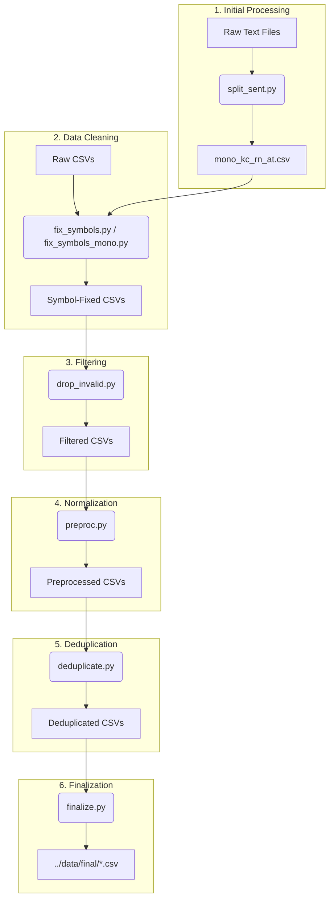

# Preprocessing Pipeline

This directory contains the scripts used to clean, filter, and harmonize the Khakas-Russian parallel and monolingual corpora. The pipeline ensures high-quality data for machine translation by addressing common issues like character encoding errors, mixed Latin/Cyrillic alphabets, and near-duplicate entries.

## 🚀 Pipeline Overview

The preprocessing workflow follows a structured path from raw data to the final training-ready format.

---

## 📄 Script Descriptions

### 1. `split_sent.py`
Processes raw monolingual Khakas `.txt` files.
- Splits text into paragraphs and then into sentences using `razdel`.
- Groups short sentences into chunks (avg. 12 words) to provide better context.
- Filters sentences by length (5–20 words).

### 2. `fix_symbols.py` & `fix_symbols_mono.py`
Addresses character-level issues in parallel and monolingual datasets.
- **Latin/Cyrillic Correction**: Fixes "confusable" characters (e.g., Latin 'a' in a Cyrillic word, Latin 'u' instead of Khakas 'ғ').
- **Standardization**: Maps varied Unicode representations of Khakas letters (like `Ӌ` to `Ҷ`) to a standard set.
- **Noise Removal**: Cleans up artifacts from web scraping (e.g., `&amp;`, `\xa0`).

### 3. `drop_invalid.py`
Applies heuristic filters to remove low-quality data.
- Drops rows with missing (`NaN`) values.
- Excludes specific unreliable sources.
- Enforces word count constraints (e.g., skip very short sentences).
- Ensures Khakas sentences contain actual Khakas-specific characters (`ІіҒғҢңҶҷӦӧӰӱ`).

### 4. `preproc.py`
Applies general NLP cleaning techniques.
- **Moses Punctuation Normalization**: Standardizes quotes, dashes, and other punctuation.
- **Unicode Normalization**: Uses **NFKC** normalization.
- **Non-printing Characters**: Removes invisible or control characters.

### 5. `deduplicate.py`
Removes redundant information within and across all datasets.
- **Exact Match**: Removes duplicate entries based on lowercased, punctuation-free text.
- **Fuzzy Deduplication**: Uses **MinHash LSH** (Jaccard similarity threshold: 0.85) to find and remove near-duplicate sentences.

### 6. `finalize.py`
Prepares the data for the training scripts.
- Applies final Moses detokenization, followed by `preproc_data` normalization to ensure clean spacing and Unicode standardization.
- Renames columns to consistent short names (`kjh`, `ru`, `source`, `file`).
- Saves the results to the project's data directory.

---

## 🛠 Utility Scripts

- **`check_symbols.py`**: A diagnostic tool to analyze character distribution and identify remaining Latin/Cyrillic mix-ups.
- **`print_random.py`**: Samples and prints random entries from the final datasets for manual quality inspection.

---

## 📝 Khakas Alphabet Reference
The pipeline ensures all Khakas text uses the standard Cyrillic-based alphabet with these specific extended characters:
`І і`, `Ғ ғ`, `Ң ң`, `Ҷ ҷ`, `Ӧ ӧ`, `Ӱ ӱ`

---

## 📋 TODO (Future Work)

- **Deduplication:** Smarter deduplication, if needed.
- **Data Cleaning:** Removing trash symbols, special tags, multiple whitespaces, etc. from texts.
- **Language Detection:** Removing texts that are not in Russian or Khakas via `facebook/fasttext-language-identification`
    - finetune for Khakas
- **Alignment Filtering:** Removing pairs that have a low alignment score - comparison via `sentence-transformers/LaBSE`
    - finetune for Khakas-Russian pair